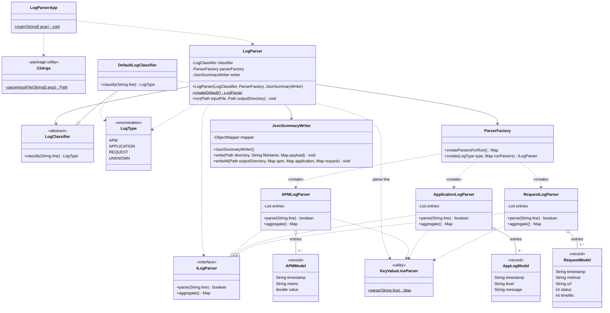

# Architecture (Java)

This document aligns the **original Python-oriented design table** and **UML intent** with this repository’s **Java packages and types**.

## From Python filenames to Java

| Original (Python-style) | Java in this project |
|-------------------------|----------------------|
| `main.py` (entry + orchestration) | `LogParserApp` (CLI entry), `LogParser` (orchestrator), `CliArgs` (argument parsing) |
| `classifier.py` | `com.logparser.classifier.LogClassifier`, `DefaultLogClassifier`, `LogType` |
| `factory.py` | `com.logparser.factory.ParserFactory` |
| `parsers/base.py` | `com.logparser.parsers.ILogParser` |
| `parsers/apm.py` | `com.logparser.parsers.APMLogParser` |
| `parsers/application.py` | `com.logparser.parsers.ApplicationLogParser` |
| `parsers/request.py` | `com.logparser.parsers.RequestLogParser` |
| `models.py` | `com.logparser.models.APMModel`, `AppLogModel`, `RequestModel` |
| `writer.py` (`JSONWriter`) | `com.logparser.writer.JsonSummaryWriter` |
| *(Java-specific helper)* | `com.logparser.util.KeyValueLineParser` (parses `key=value` lines, including quoted values) |

## Source tree (`src/main/java`)

```text
com.logparser/
├── LogParserApp.java          # public static void main(String[] args)
├── LogParser.java             # run(Path inputFile, Path outputDirectory)
├── CliArgs.java               # parseInputFile(String[] args)
├── classifier/
│   ├── LogType.java           # enum: APM, APPLICATION, REQUEST, UNKNOWN
│   ├── LogClassifier.java     # abstract classify(String)
│   └── DefaultLogClassifier.java
├── factory/
│   └── ParserFactory.java     # createParsersForRun(), create(LogType, Map<...>)
├── parsers/
│   ├── ILogParser.java        # Strategy interface
│   ├── APMLogParser.java
│   ├── ApplicationLogParser.java
│   └── RequestLogParser.java
├── models/
│   ├── APMModel.java          # record
│   ├── AppLogModel.java       # record
│   └── RequestModel.java      # record
├── writer/
│   └── JsonSummaryWriter.java # writeAll(...) → apm.json, application.json, request.json
└── util/
    └── KeyValueLineParser.java
```

## Design patterns (unchanged intent, Java realization)

| Pattern | Where in Java |
|---------|----------------|
| **Strategy** | `ILogParser` implemented by `APMLogParser`, `ApplicationLogParser`, `RequestLogParser` — same `parse` / `aggregate` contract, different behavior. |
| **Factory method** | `ParserFactory.createParsersForRun()` builds the map of strategies; `create(LogType, runParsers)` returns the instance for the current line without the orchestrator naming concrete classes. |
| **Classifier abstraction** | `LogClassifier` + `DefaultLogClassifier` — “what kind of line is this?” is pluggable; the read loop stays the same. |

**Note vs. an earlier UML sketch:** some diagrams showed `LogClassifier._patterns()`. This codebase encodes rules directly in `DefaultLogClassifier` (required key sets and order). You can still describe that as the concrete “pattern” hook if you extend the diagram.

**Parser lifetime:** `LogParser.run` calls `createParsersForRun()` once and reuses the same `ILogParser` instances for the whole file so `aggregate()` reflects all accepted lines.

## CLI and outputs

- **Run:** `java -jar target/log-parser-1.0.0-SNAPSHOT.jar --file input.txt` (after `./mvnw package`), or `./mvnw exec:java -Dexec.args="--file input.txt"`.
- **Outputs:** `apm.json`, `application.json`, `request.json` in the process working directory (see `LogParserApp`).

## UML (generated from code)

Canonical **PlantUML** diagram (full packages, generics, fields): [`docs/uml-class-diagram.puml`](docs/uml-class-diagram.puml).  
**Exported PNG:** [`docs/uml-class-diagram.png`](docs/uml-class-diagram.png) (built with `!pragma layout smetana` so **Graphviz is not required**).

Regenerate the PNG (downloads PlantUML to `/tmp`):

```bash
export JAVA_HOME="$(dirname "$(dirname "$(realpath "$(which java)")")")"   # or your JDK 17 home
curl -fsSL -o /tmp/plantuml.jar "https://repo.maven.apache.org/maven2/net/sourceforge/plantuml/plantuml/1.2024.7/plantuml-1.2024.7.jar"
java -jar /tmp/plantuml.jar -charset UTF-8 -tpng docs/uml-class-diagram.puml
```

You can also render with an IDE PlantUML plugin or [plantuml.com](http://www.plantuml.com/plantuml).

### Class diagram (Mermaid)

Same structure as the PlantUML file; types like `Map<String,Object>` are abbreviated as `Map` where Mermaid breaks on generics.



**Notes**

- `LogParser.run`, `JsonSummaryWriter.write`, and `JsonSummaryWriter.writeAll` declare **`throws IOException`** in Java (see PlantUML notes in `docs/uml-class-diagram.puml`).
- `ILogParser.aggregate()` returns **`Map<String, Object>`**; `KeyValueLineParser.parse` returns **`Map<String, String>`**.
- `CliArgs` is **package-private** (`~` in UML); only types in `com.logparser` call it.
- `LogParser` **owns** (constructor-injected) classifier, factory, and writer; concrete parsers **implement** `ILogParser` and **aggregate** models in `entries` before building summary maps.
